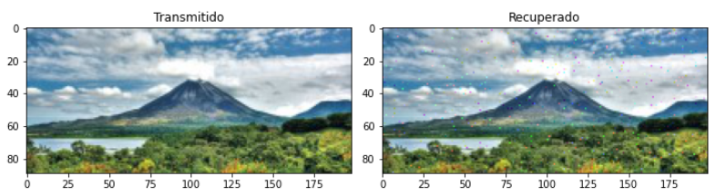
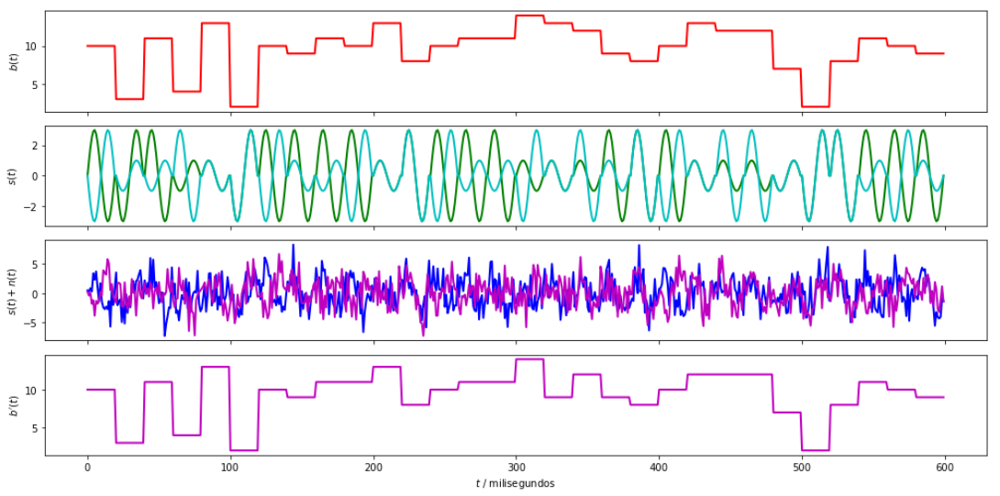

# Proyecto 4: Modelos Probabilisticos de senales y sistemas

Francisco Segura Hernandez B66760
Grupo 1

## Parte 1:

Despues de realizar la modulacion es posible identificas diferencias respecto a la BPSK, como que el 16QAM dura 2.7s, en cambio BPSK dura 6.4s, por lo tanto es una direncia del 57%.

Ademas tambien se nota que es mas susceptible al ruido la modulacion por 16QAM, ya que fue necesario aumentar el Signal-to-noise ratio, para obtener un BER similar.

#### Comparativa Imagenes

## Parte 2:

## Parte 3:

La densidad espectral de potencia muestra que la senal si tiene su mayor potencia en 5kHz, pero tambien tiene armonicos en 3kHz, 7kHz y 6kHz.

