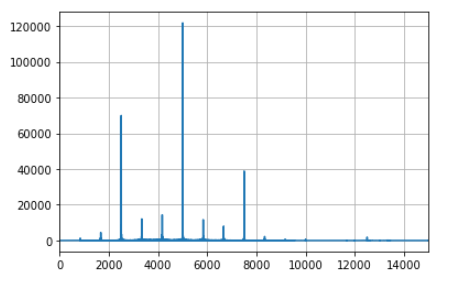

# Proyecto 4: Modelos Probabilisticos de senales y sistemas

Francisco Segura Hernandez B66760
Grupo 1

## Parte 1:

Despues de realizar la modulacion es posible identificar diferencias respecto a la BPSK, como que el 16QAM dura 2.7s, en cambio BPSK dura 6.4s, por lo tanto es una diferencia del 57%, lo cual confirma lo esperado y es que la modulacion 16QAM tiene una mayor tasa de datos debido al tamano de sus simbolos.

Ademas tambien se nota que es mas susceptible al ruido la modulacion por 16QAM, ya que fue necesario aumentar el SNR, para obtener un BER similar. Esto tambien era de esperar ya que el aumento de los simbolos causa que se redusca la distancia entre los puntos de modulacion, causan que sea mas facil para el ruido interferir.

#### Comparativa Imagenes

La comparacion de la imagen transmitida vs la recibida se muestra a continuacion:

Las senales resultantes se muestran a continuacion:

## Parte 2:

## Parte 3:

La densidad espectral de potencia muestra que la senal si tiene su mayor potencia en 5kHz, pero tambien tiene armonicos en 3kHz, 7kHz y 6kHz.

